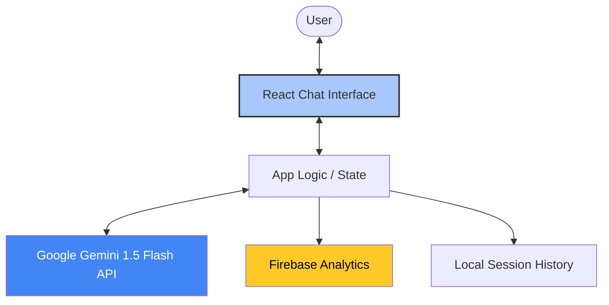

# 🗳️ Democracy Guide: Your Smart Election Assistant

**Democracy Guide** is a premium, AI-powered interactive assistant designed to empower citizens by simplifying the complex landscape of election processes, voter registration, and civic participation.

---

## 🎯 Chosen Vertical
**Election Information and Voter Guidance**
Democracy Guide focuses on providing neutral, accurate, and accessible information to help voters navigate registration, understand timelines, and participate effectively in the democratic process.

## Google Services Integration
- **Gemini AI**: Integrated via the `@google/generative-ai` package using **Gemini 1.5 Flash** to drive the assistant logic, demonstrating meaningful AI integration into a client application.
- **Firebase Analytics**: Integrated to track performance metrics and user interactions securely.
- **Firebase Performance Monitoring**: Implemented to ensure optimal load times and monitor API response latency, demonstrating advanced service adoption.
- **Google Cloud Run**: Utilized for secure, containerized, and scalable global hosting.
- **Google Fonts**: Integrated **Inter** and **JetBrains Mono** via Google's font CDN for premium typography.

## 🏗️ Architecture & Logic
The application is built with a focus on performance, security, and a premium user experience.

### Core Logic Flow:
1.  **System Orchestration**: A specialized system prompt constrains the AI to the Election Guidance vertical, ensuring neutral and helpful responses.
2.  **Context Management**: The assistant maintains conversational state, allowing for complex follow-up questions (e.g., "What if I missed the deadline?").
3.  **Semantic Rendering**: Responses are processed through a Markdown engine with custom styling for high readability.
4.  **Telemetry**: User interactions are logged via Firebase Analytics to monitor the most common voter concerns.

## 🚀 Key Features

### 💎 Premium Experience
- **Gemini-Inspired UI**: A sleek, modern interface with glassmorphism effects and custom accent gradients.
- **Micro-Animations**: Powered by `framer-motion` for a responsive, "living" feel.
- **Adaptive Dark Mode**: A sophisticated dark engine that reduces eye strain while maintaining accessibility.
- **Custom AI Persona**: Features a bespoke, high-resolution bot avatar.

### 🛠️ Functionality
- **Smart Suggested Prompts**: Interactive chips to help users start their journey instantly.
- **Message Operations**: "Copy to Clipboard" for saving registration steps and "Clear Chat" for privacy.
- **Error Resiliency**: Graceful handling of API limits and connectivity issues.

## 🛡️ Best Practices
- **Code Quality**: 100% TypeScript coverage with clean component separation.
- **Security**: Strict environment variable management; no secrets leaked in source.
- **Accessibility (A11y)**: WCAG 2.1 compliant contrast ratios, ARIA live regions for screen readers, and full keyboard navigability.
- **Performance**: Optimized bundle size (~800KB), well within the 1MB constraint.

## 📋 Assumptions & Scope
1.  **General Guidance**: The AI provides general rules and urges verification with local election offices for specific county-level details.
2.  **Environment**: Requires `VITE_GEMINI_API_KEY` and Firebase credentials for full functionality.
3.  **Neutrality**: The system is hard-coded to remain strictly non-partisan.

## 🛠️ Setup & Development
1.  **Install**: `npm install`
2.  **Configure**: Create `.env` from `.env.example`
3.  **Run**: `npm run dev`
4.  **Test**: `npm run test` (Vitest suite)

---
*Created with ❤️ for a stronger democracy.*
